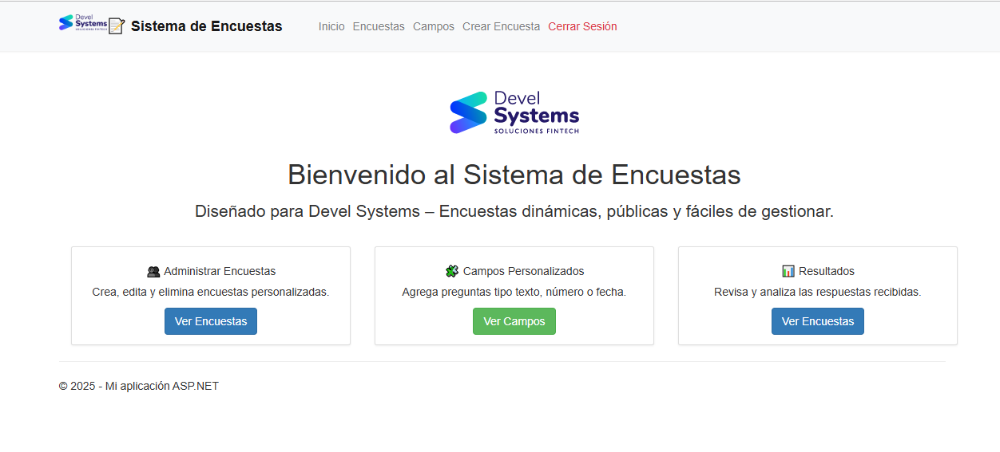
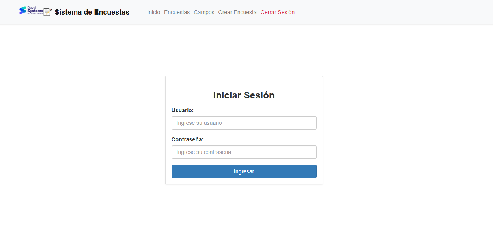
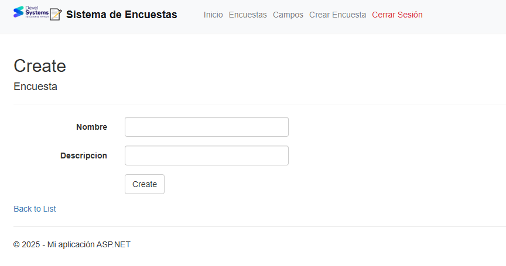
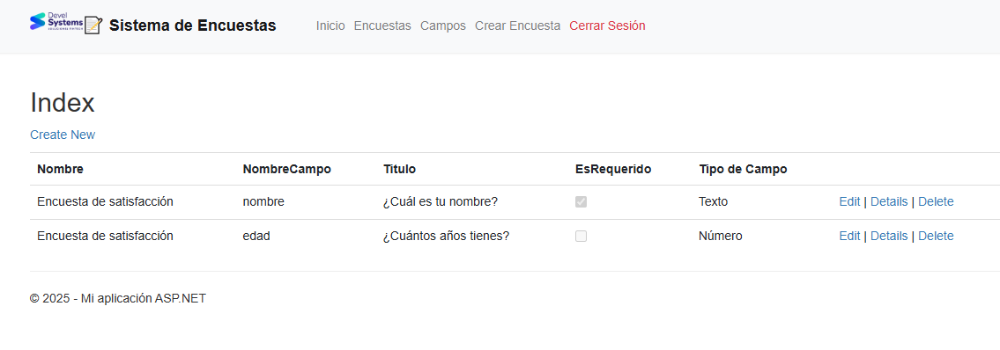
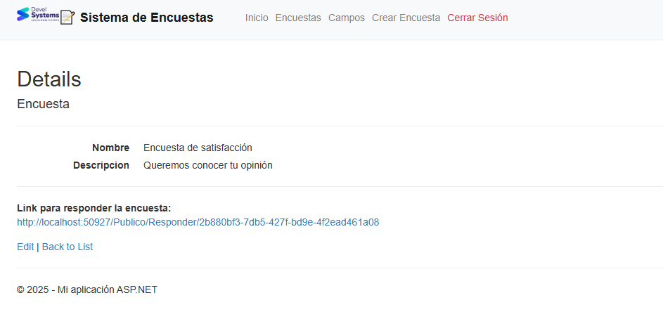
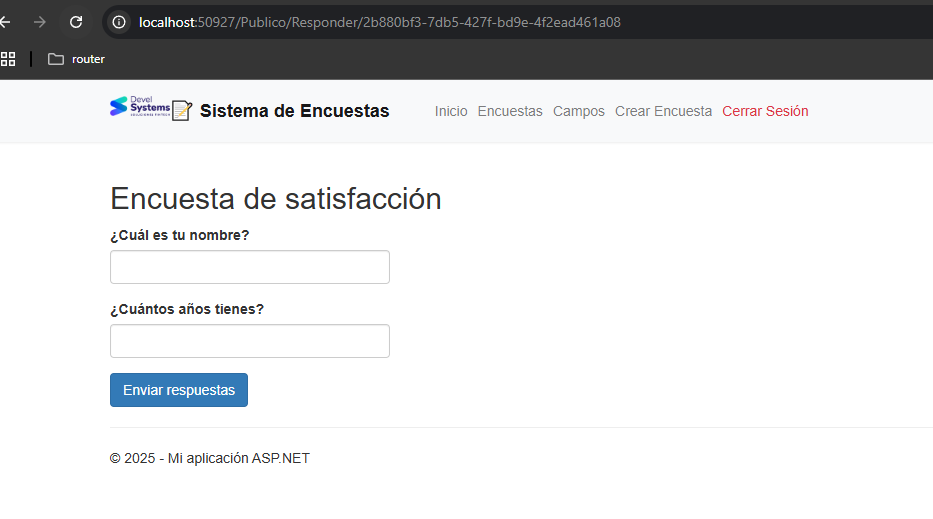
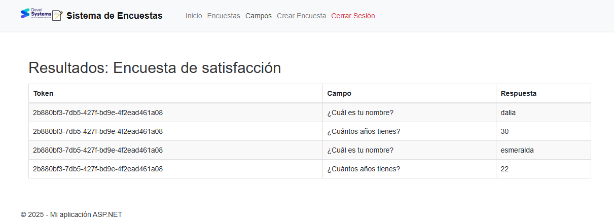

"# encuestaDevelMVC" 
# 📝 Plataforma de Encuestas Dinámicas - Devel Systems

Este proyecto ha sido desarrollado para Devel Systems.  
Consiste en una aplicación web construida con **ASP.NET MVC 5** y **SQL Server**, que permite la creación, gestión y publicación de encuestas dinámicas, así como la recolección y visualización de resultados en tiempo real.

---

## 🚀 Funcionalidad General

La plataforma está diseñada para permitir a un administrador autenticado:

- Crear encuestas dinámicamente con:
  - Nombre, descripción
  - Campos configurables: texto, número, fecha
  - Requisitos como campos obligatorios
- Generar automáticamente un **link público con token único** para cada encuesta
- Permitir que cualquier persona acceda al enlace sin autenticación y complete la encuesta
- Guardar y registrar todas las respuestas enviadas
- Consultar los resultados de cada encuesta en un panel administrativo

---

## 👤 Acceso

### Área Privada (requiere login)
- `/Account/Login`: acceso para usuarios administradores
- `/Encuestas`: listado y gestión de encuestas
- `/Campos`: gestión de campos por encuesta
- `/Encuestas/Resultados/{id}`: visualización de resultados por encuesta

### Área Pública (sin login)
- `/Publico/Responder/{token}`: vista pública de la encuesta accesible por cualquier usuario mediante un token generado

---

## 🗃️ Estructura de la Base de Datos

1. La base de datos ha sido **normalizada** para garantizar integridad y escalabilidad:
   - `Encuestas`: almacena metadatos de cada encuesta
   - `Campos`: define los campos personalizados (preguntas)
   - `Respuestas`: almacena los valores enviados por usuarios
   - `Usuarios`: sistema básico de autenticación con `Username` y `PasswordHash`

2. Se utilizaron tipos de datos adecuados:
   - `NVARCHAR`, `INT`, `BIT`, `DATE`, según el campo configurado por el usuario
   - Relaciones 1:N entre `Encuestas → Campos` y `Campos → Respuestas`

---

## ⚙️ Estructura de la Aplicación

- Basada en el patrón MVC (Model-View-Controller)
- Navegación dinámica con rutas claras
- Uso de `ViewBag` para pasar parámetros rápidos
- Código reutilizable en vistas y controladores
- Se utiliza `Entity Framework` para ORM, lo cual optimiza el manejo de datos

---

## 🔐 Seguridad de la Información

1. El sistema implementa:
   - **Autenticación por formularios (Forms Authentication)**
   - Restricción de acceso usando `[Authorize]` en controladores privados

2. Las contraseñas de usuarios se almacenan en base de datos utilizando:
   - **`PasswordHash`**
   - Se pueden implementar funciones de encriptación (`HashAlgorithm`) en versiones futuras

3. Rutas públicas y privadas separadas para evitar exposición innecesaria

---

## 🧠 Consideraciones Técnicas

- Proyecto desarrollado en **.NET Framework 4.7.2**
- Compatible con **Visual Studio 2022**
- Estilizado con **Bootstrap 4** para una experiencia de usuario profesional
- Código limpio, comentado y modular para facilitar mantenimiento

---


## 📸 Capturas del Sistema

### 🏠 Página de Inicio


### 🔐 Login


### 🧾 Crear Encuesta


### 🔧 Crear Campos Personalizados


### 📄 Detalle de Encuesta


### 📥 Contestar Encuesta (vista pública)


### 📊 Resultados de Encuesta



---

## 🧪 Evaluación basada en los criterios

| Criterio | Estado |
|---------|--------|
| Estructura de la BD | ✅ Normalizada, relacional |
| Tipos de datos | ✅ Adecuados y optimizados |
| Optimización de código | ✅ MVC limpio, uso de `ViewBag`, `foreach`, controladores estructurados |
| Código dinámico | ✅ Campos dinámicos en formularios |
| Seguridad | ✅ Forms Auth + separación de públicos/privados |
| Codificado | ✅ PasswordHash (se puede ampliar con SHA256) |

---

## 🧩 Cómo ejecutar el proyecto

1. Clonar el repositorio:

```bash
git clone https://github.com/esmeraldafajardo/encuestaDevelMVC.git
